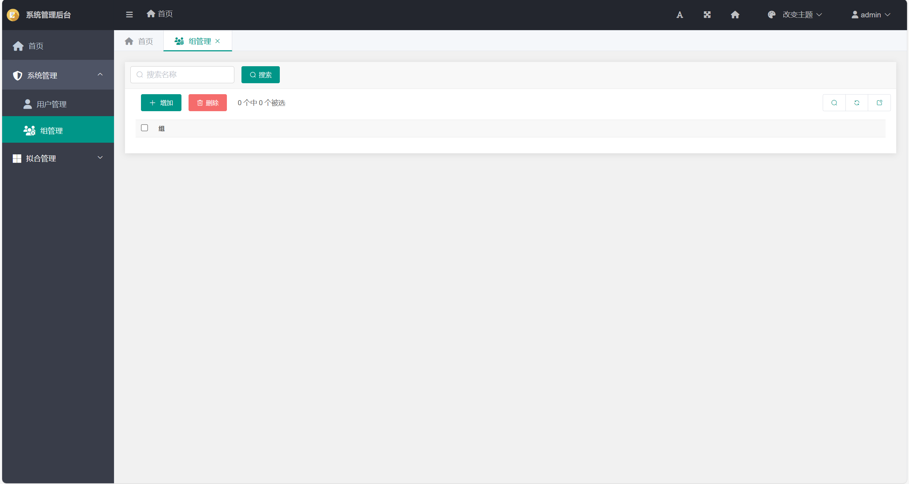

# 程序使用说明

## 程序登录

打开浏览器，输入127.0.0.1:8000，即展示Web界面，输入用户名以及密码进行登录操作。

## 程序主界面

程序主界面包含导航栏，用户状态栏以及总览界面。通过上方工具条可以进行调整字体大小、全屏显示、回到主页、改变主题和进行用户修改密码与登出等操作。通过左侧导航栏可以添加/删除系统用户，以及进行拟合模型管理等操作。

## 用户管理

进入系统管理-用户管理，可以进行用户的增减以及修改用户信息等操作。

## 用户组管理

## RSS指纹库生成

## RSS指纹库生成历史

## RSS指纹匹配

## RSS指纹匹配效果图

图5-15 RSS指纹匹配效果图选择界面

